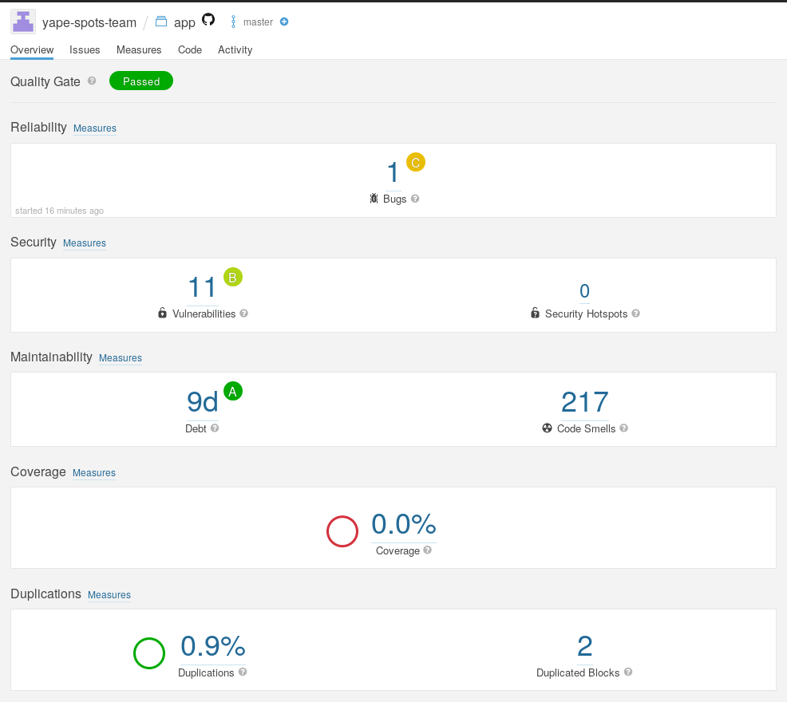

# Yape Spots

## 1. Project General Information
**Target user profile:**

A currently Yape's user, whose people are between the age of 18 and 34, who have Yape in their smartphones.

**Value proposition:**

Make business that have Yape (Yape spots) visible to the Yape community. Making easier for the users to find locals that use Yape and increasing the number of clients that a business can get only for the use of Yape.

**Mockup**

The Mockup can be found [here](https://projects.invisionapp.com/prototype/main-Activity-cjuq7glmm003dh001vjrrcyj3/play/7c7e3056)

## 2. User Guide

The user guide can be found [here](/documentation/user_guide/user_guide.md).

## 3. Developer Guide

The developer guide can be found [here](/documentation/developer_guide/developer_guide.md).

## 4. Project Portfolio Page

The Project Portfolio Page can be found [here](/documentation/project_portfolio_pages/ppp.md).

## 5. Code Quality Report

The Code Quality Report can be found [here](https://sonarcloud.io/dashboard?id=yape-spots-team_yape-app-sonar2).  

Also here is an screenshot of it:

